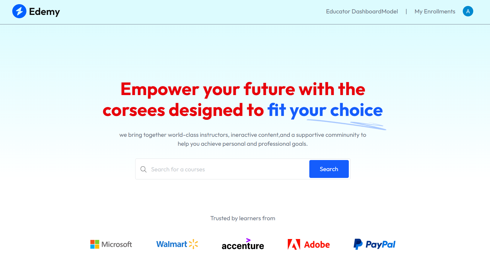
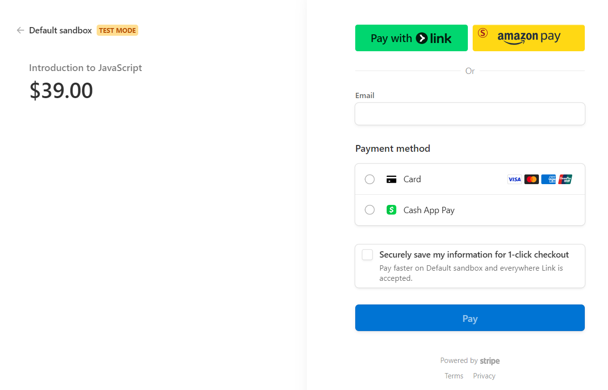

# Learning Management System (LMS) | MERN Stack


[](https://lms-frontend-lovat-rho.vercel.app/)

---

## 📚 Table of Contents

- [Features](#-features)
- [Tech Stack](#-tech-stack)
- [Screenshots](#-screenshots)
- [Getting Started](#-getting-started)
- [License](#-license)

---

## ✨ Features

- Secure course enrollment and payment with **Stripe** integration.
- Course preview functionality before enrollment.
- User authentication and access control with **Clerk**.
- Real-time progress tracking with dynamic progress bars.
- Course rating and review system.
- Responsive and mobile-friendly UI with **Tailwind CSS**.

---

## 🛠️ Tech Stack

- **Frontend:** React.js, Tailwind CSS
- **Backend:** Node.js, Express.js
- **Database:** MongoDB
- **Authentication:** Clerk
- **Payments:** Stripe
- **Version Control:** Git, GitHub

---

## 📸 Screenshots

> Make sure you save your screenshots in a `screenshots` folder!

### 🏠 Home Page


### 🎥 Course Preview


### 💳 Checkout (Stripe Payment)



---

## 🚀 Getting Started

### Prerequisites

- Node.js installed
- MongoDB database (local or cloud)
- Stripe account for payment processing
- Clerk account for authentication

### Installation

```bash
# Clone the repository
git clone https://github.com/your-username/your-repo-name.git

# Navigate into the project directory
cd your-repo-name

# Install dependencies
npm install

# Set up environment variables
cp .env.example .env

# Run the application
npm run dev
